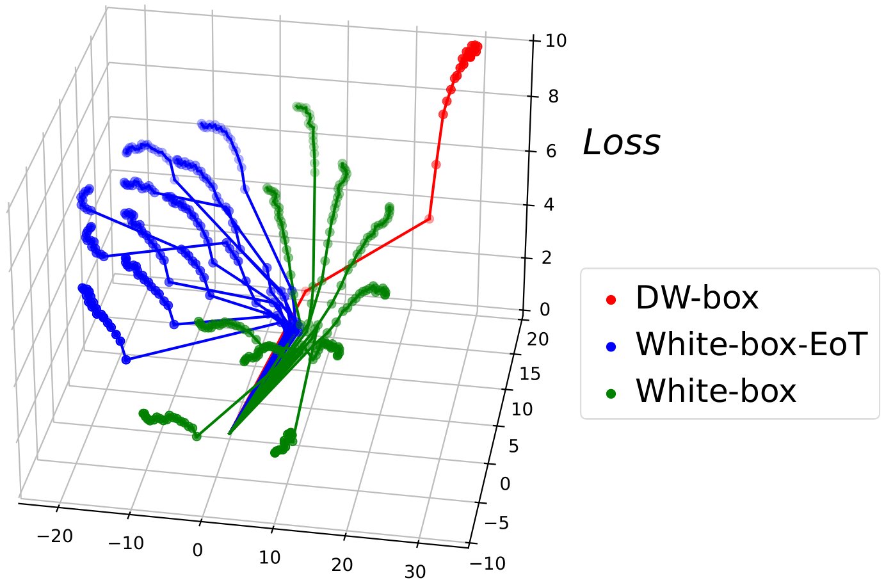
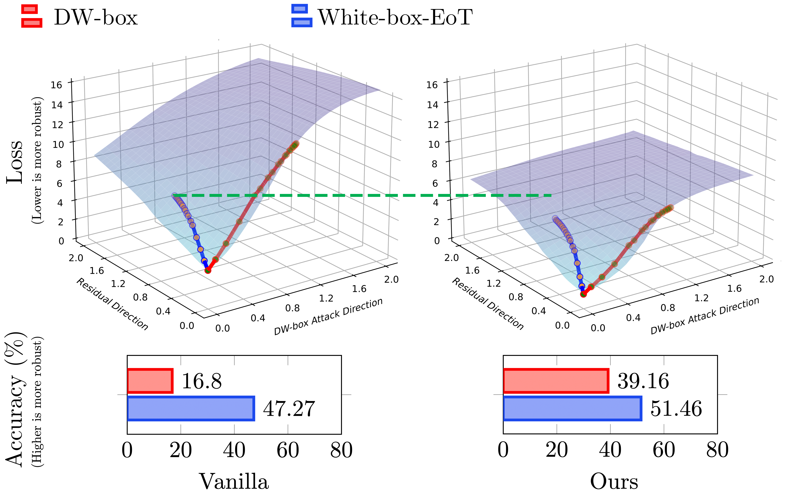

# ADDT/Fixed AutoAttack
Official code for ICLR2025 Paper "[Towards Understanding the Robustness of Diffusion-Based Purification: A Stochastic Perspective](https://openreview.net/forum?id=shqjOIK3SA)"


##

Comparison of attack trajectories under different evaluation settings.


Losslandscape

Adversarial attack visualization:


Adversarial Denoising Diffusion Training (ADDT):


RBGM:


# Directory Structure
```
This project contains code for model training, testing/evaluation, and related utilities. The directory structure and its contents are described below:

* `test/`: Contains all code and scripts related to model testing and evaluation.
    * `main_code/`: Houses the core Python code for performing attack evaluations and clean performance evaluations on various diffusion models, including DDPM, DDIM, VPSDE, and EDM.
    * `scripts_*/`: Provides shell scripts for running the evaluation tasks defined in `main_code/`. To execute a specific evaluation, navigate to the corresponding script directory and run the script using `sh`. For example, to run the $L_{\infty}$ attack test:
        ```bash
        cd test/script_attack
        sh ddpm_run_attack_linf.sh
        ```

* `fid/`: Contains the necessary code to calculate the Fréchet Inception Distance (FID) metric. FID is a common metric used for evaluating the quality of generated images, particularly from generative models.

* `train_DDPM_DDIM/`: Includes the code for training DDPM (Denoising Diffusion Probabilistic Models) and DDIM (Denoising Diffusion Implicit Models).
Supports both standard ('clean') training setups and potentially setups involving ADDT (Adversarial Diffusion Distillation Training.

* `train_VPSDE_DDPMPP/`: Contains the code for training models based on VPSDE (Variance Preserving Stochastic Differential Equation) and DDPMPP.
 Similarly supports standard ('clean') and potentially ADDT training variants.

* `train_edm_ADDT/`: Contains the training code specifically for EDM (Elucidating Diffusion Models) integrated with the ADDT technique.

* `image/`: Stores image files referenced within this `README.md` file.
```

# How to use Fixed AutoAttack

### Installation

```
pip install git+https://github.com/fra31/auto-attack
cd Fixed-AutoAttack
pip install -e .
```

## Citation
```
@inproceedings{
liu2025towards,
title={Towards Understanding the Robustness of Diffusion-Based Purification: A Stochastic Perspective},
author={Yiming Liu and Kezhao Liu and Yao Xiao and ZiYi Dong and Xiaogang Xu and Pengxu Wei and Liang Lin},
booktitle={The Thirteenth International Conference on Learning Representations},
year={2025},
url={https://openreview.net/forum?id=shqjOIK3SA}
}
```


