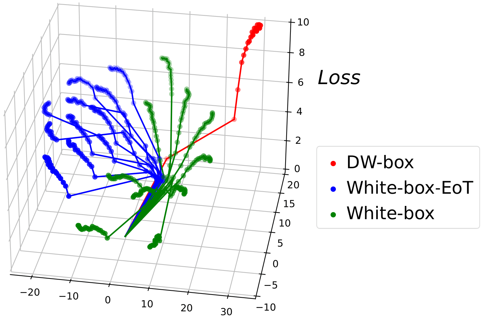
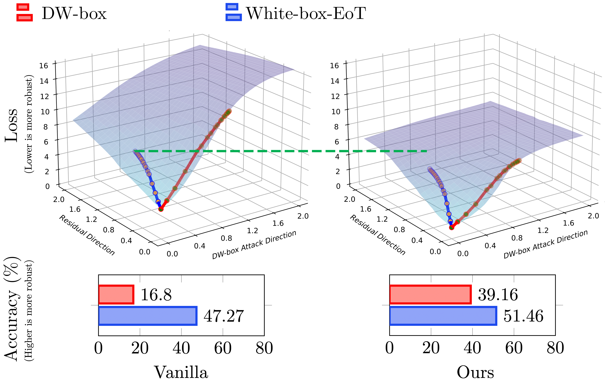
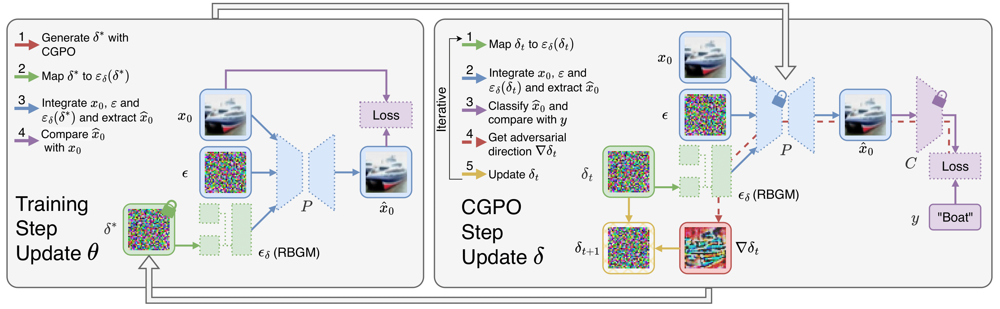
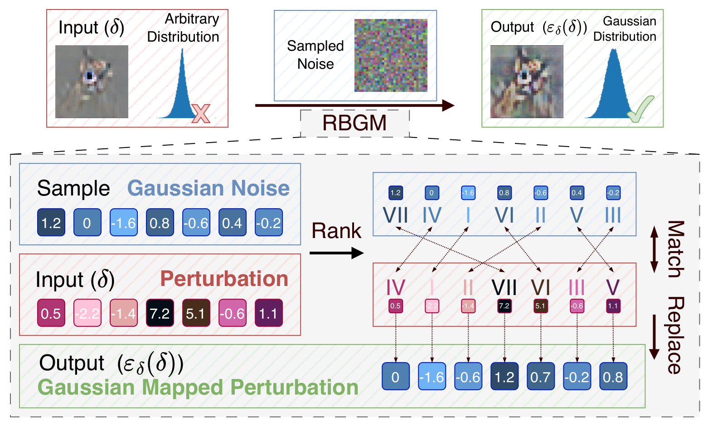

# Introduction
Official code for Paper "Towards Better Adversarial Purification via Adversarial Denoising Diffusion Training"

Comparison of attack trajectories under different evaluation settings.

Losslandscape

Adversarial Denoising Diffusion Training (ADDT)

RGBM

# Requirements
* python
* transformers
* pytorch 2.0.1
* numpy
* tqdm
* loguru
* diffusers>=0.20.0.dev0
* torchvision
* click>=8.0
* pillow>=8.3.1
* scipy>=1.7.1
  
# Directory Structure
running scripts are in the corresponding directory.
### All testing code(attack/clean evaluation for DDPM/DDIM/VPSDE/edm)
test/

├─ main_code: codes for attack/clean evaluation

├─ scripts_*: scripts for running the code, just "cd" to the directory and run the script, e.g. "cd test/script_attack && sh ddpm_run_attack_linf.sh"
### Code for calculating FID
fid/
### All training code for DDPM/DDIM/VPSDE/edm clean/ADDT
train_DDPM_DDIM/

train_VPSDE_DDPMPP/

train_edm_ADDT/
### Images for README.md
image/

# For opensource community and future research
All ckpts will be released after the paper is accepted. And we will refactor the code for more convenient use.